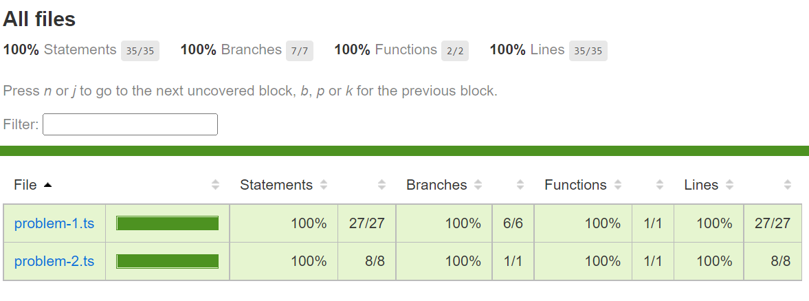

# Coding Challenges 💻

## :construction_worker: Installation

**You need to install [Node.js](https://nodejs.org/en/download/) and [Yarn](https://yarnpkg.com/) first, then in order to clone the project via HTTPS, run this command:**

```git clone https://github.com/wenderpmachado/coding-challenges.git```

SSH URLs provide access to a Git repository via SSH, a secure protocol. If you have a SSH key registered in your Github account, clone the project using this command:

```git clone git@github.com:wenderpmachado/coding-challenges.git```

After that, install all dependencies running:

```bash
yarn install
```

## :runner: Running tests

Each code challenge has unit tests with use cases. To run the tests, use the command:

```bash
  yarn test

  // or...

  yarn test:dev
```

> To see the test coverage, open the file `coverage/lcov-report/index.html` in your browser, after running the command above.



## :bug: Issues

If you already found a solution to your problem, **I would like to review your pull request**!

## :closed_book: License

Released in 2020.
This project is under the [MIT license](https://github.com/wenderpmachado/coding-challenges/main/LICENSE).

Made by [Wender Machado](https://github.com/wenderpmachado) 💚🚀
